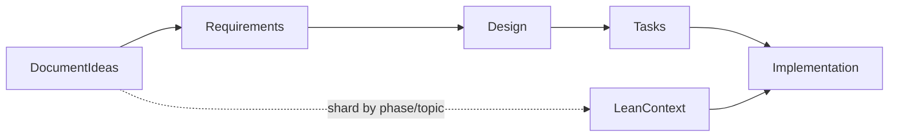

# Genai Spec System Documentation

> **Archived — skills migration in progress.** Legacy `.mdc` rule import is deprecated.
> Use the Agent Skills library under [`skills/`](skills/) instead. Tracking:
> [Issue #5](https://github.com/betsalel-williamson/genai-specs/issues/5).

## SDLC Agent Skills (recommended)

This repository now ships a progressive-disclosure **Agent Skills** library for general software development lifecycle work:

- **Meta:** `skills/_meta/` — discovery, markdown context protocol, skill authoring (vendored Anthropic `skill-creator` + Cursor `create-skill`)
- **Spec-flow:** `skills/sdlc/` — user stories, design, tasks, architecture, ADRs
- **Engineering:** `skills/engineering/` — principles, TDD/Tidy First, coding standards
- **Domains:** `skills/domains/` — path-scoped stack guidelines (`references/` shards)
- **Verification:** `skills/verification/` — agent behavioral verification

Migration docs: [`docs/skills-migration/`](docs/skills-migration/). Refresh skills from legacy sources:

```bash
./scripts/translate-specs-to-skills.sh
./scripts/setup-cursor-skills.sh
```

Legacy `rules/*.mdc` files are deprecation stubs pointing to skills. Original guideline shards remain in `guidelines/` during transition.

Install skills in Cursor-compatible projects by cloning this repo and running `./scripts/setup-cursor-skills.sh` (creates `.cursor/skills` → `skills/`; `.cursor/` is gitignored).

## What This Was

This repository was a spec-driven system for AI-assisted development. It provided standards and guidelines through `.mdc` rule files that could be imported as a Git submodule and wired into coding assistants (Cursor, Gemini CLI, and others). The system used three inclusion strategies—always-on core rules, conditional loading by file type, and manual `@filename` references—to steer LLM behavior during development.


Want to learn more? Watch my presentation given to the DORA community on September 30, 2025.

[](https://youtu.be/9Goq80lgxSY?si=aXRjM3bF8gOsHjce&t=732)

[Link to presentation slides](https://docs.google.com/presentation/d/1nIUlmhMPMR-9znfg_rz1dVizWQVJ8rxn2JWSLxGEVMY/edit?usp=sharing)

## Why It Is Archived

AI coding assistants have matured substantially since this system was published. Tools like Cursor, Claude, and Gemini now handle planning, context management, and implementation far better than when this repo was built. Importing a large, always-on ruleset into every project adds friction and stale constraints. The specific `.mdc` files and init scripts reflect a point-in-time workflow—not a current best practice. I no longer import these strict rules into my repos.

## What Still Applies

These lessons remain useful even as the tooling evolves:

### Spec-flow: document before you code

The key to working with LLMs to code is documenting your ideas in phases before asking the model to implement. Walk through requirements, design, and tasks—then implement. This spec-flow approach reduces scope creep and gives the LLM a clear contract to work against.

User stories capture end-user value and experience; design documents hold technical requirements, API specifications, and implementation details. Keep that separation when you document.

Example layout in this repo:

```text
.work-items/{feature_name}/
├── user-story.md
├── design.md
└── task.md
```



Important: LLMs tend to say "yes" to requests and add scope creep even when not prompted. Work within a value stream management framework to ensure that the features you are working on are worth the time and effort. The feature may need to be broken down into multiple smaller features.

### Sharding: keep context lean

Split guidance into focused, load-on-demand documents rather than one monolithic prompt. This prevents overloading the LLM with context it does not need for the current task.

This repo modeled that pattern through:

- **Always included** — core principles in `rules/process-*.mdc`
- **Manual inclusion** — phase-specific standards loaded on demand (for example, `@./rules/standards-design.mdc`)
- **Conditional inclusion** — technology guidelines loaded when working with certain file types
- **Deep sharding** — topic-specific detail in [`guidelines/`](guidelines/) referenced by thinner rule files

See [process-02-project.mdc](rules/process-02-project.mdc) for the original context-efficiency rationale.

### Structured prompts over strict rules

Rather than permanently importing rigid always-on rules into every repo, use intentional, phase-specific prompts to guide planning and implementation. The standards files in this repo remain useful as **prompt templates** for building plans—not as permanent project configuration:

1. **User stories** — [standards-user-story.mdc](rules/standards-user-story.mdc) for end-user value and experience
2. **Technical design** — [standards-design.mdc](rules/standards-design.mdc) for requirements and implementation details
3. **Tasks** — [standards-task.mdc](rules/standards-task.mdc)
4. **Architecture & decisions** — [standards-architecture.mdc](rules/standards-architecture.mdc), [standards-decision.mdc](rules/standards-decision.mdc)

Example prompts you can adapt:

```bash
# Working on user stories (end-user value)
"Create user story for user authentication using the format in standards-user-story.mdc"

# Working on technical design (implementation details)
"Create technical design for user authentication using standards-design.mdc"

# Need an architecture decision
"Should we use microservices? Use the ADR format from standards-decision.mdc"
```

## How to Use This Repo Today

- **Browse** standards and guidelines as reference material, or copy snippets into your own prompts
- **Do not** treat [cursor-init.sh](cursor-init.sh) or [gemini-cli-init.sh](gemini-cli-init.sh) as recommended setup
- **Prefer** project-specific structured prompts tailored to your stack and current tooling

### Historical setup (deprecated)

This repo was originally imported as a Git submodule with platform-specific init scripts. That workflow is no longer recommended. The scripts remain in the repository for anyone maintaining legacy imports:

- [cursor-init.sh](cursor-init.sh) — Cursor IDE submodule setup
- [gemini-cli-init.sh](gemini-cli-init.sh) — Gemini CLI submodule setup

## Repository Contents

- [`rules/process-*.mdc`](rules/) — process and engineering principles
- [`rules/standards-*.mdc`](rules/) — spec-phase templates (user story, design, task, architecture, ADR)
- [`rules/guidelines-*.mdc`](rules/) + [`guidelines/`](guidelines/) — topic-sharded deep dives
- [`.work-items/`](.work-items/) — example spec-flow artifacts

## Acknowledgements

This steering system and development methodology uses established practices and ideas from experts in software development:

### Spec-Driven Development

- **Pierce Boggan & Harald Kirschner** - Virtual workshop on spec-driven development
  [Microsoft Build Session BRK102](https://build.microsoft.com/en-US/sessions/BRK102)
- **Vivek Haldar** - Musings on spec-driven development
  [Spec-Driven Vibe Coding](https://vivekhaldar.com/articles/spec-driven-vibe-coding/)

### Test-Driven Development & Code Quality

- **Kent Beck** - Test-Driven Development (TDD) and "Tidy First" methodologies
  [Augmented Coding: Beyond the Vibes](https://tidyfirst.substack.com/p/augmented-coding-beyond-the-vibes?open=false#§appendix-system-prompt)
- **Paul Hammond** - Comprehensive development practices and AI collaboration patterns
  [Claude Configuration](https://github.com/citypaul/.dotfiles/blob/main/claude/.claude/CLAUDE.md)
- **DORA Community** - Excellent documentation about software development best practices and community support.
  [Community Website](https://dora.community/)
  [DORA Practices Website](https://dora.dev)

### Engineering Principles

The core engineering principles combine best practices from:

- Continuous delivery and DevOps methodologies
- Domain-driven design patterns
- Functional programming principles
- Modern software architecture patterns

These ideas have been adapted and combined to create a unified system for AI-assisted development. This system maintains high code quality while enabling fast, iterative progress.
