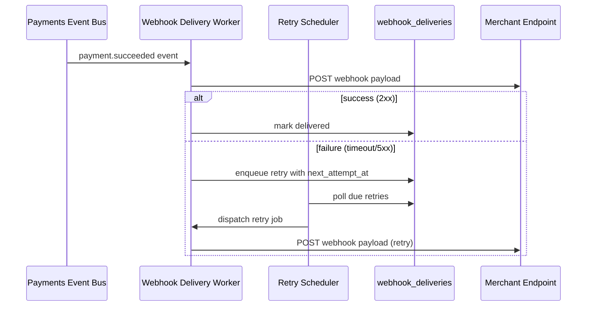

# Technical Design: Webhook Retry Logic for Payments Service

## 1. Objective

Implement reliable, observable webhook delivery with configurable retry and backoff so payment event notifications reach merchant endpoints even when transient failures occur, consistent with the payments platform's event-driven architecture.

## 2. Technical Design

This design introduces a **Webhook Delivery Worker** and **Retry Scheduler** that sit between the existing Payments Event Bus and outbound HTTP delivery. Failed deliveries are persisted and re-attempted according to a backoff policy without blocking the core payment transaction path.



**Architecture alignment:** This design follows the event-driven, loosely coupled service boundaries defined in `standards-architecture.md` (see `skills/sdlc/spec-architecture/SKILL.md`). Specifically:

- **Async side effects:** Webhook delivery remains off the synchronous payment authorization path, matching the architecture principle that external integrations must not block core transaction commits.
- **Idempotency and at-least-once delivery:** Retry attempts reuse the same `delivery_id` and `Idempotency-Key` header, aligning with the platform's idempotent consumer contract for downstream systems.
- **Observability by default:** Metrics and structured logs are emitted per delivery attempt, consistent with the architecture requirement that all integration boundaries expose tracing and failure telemetry.
- **Fail-safe degradation:** After exhausting retries, deliveries move to a dead-letter state rather than blocking event processing, per the architecture's graceful-degradation guidance for non-critical outbound integrations.

### New Components

| Component | Role |
|-----------|------|
| `WebhookDeliveryWorker` | Consumes payment events, signs payloads, performs HTTP POST, records attempt outcomes |
| `RetryScheduler` | Polls `webhook_deliveries` for due retries and re-enqueues work to the worker |
| `WebhookSigningService` | Generates HMAC signatures using merchant-specific secrets (existing shared service) |

## 3. Key Changes

### 3.1. API Contracts

No new public merchant-facing REST endpoints. Internal operational endpoints:

**`GET /internal/webhooks/deliveries/{delivery_id}`**

- **200 OK:** Returns delivery status, attempt history, and next retry time
- **404 Not Found:** Unknown `delivery_id`

**`POST /internal/webhooks/deliveries/{delivery_id}/retry`**

- **202 Accepted:** Manual retry enqueued (ops override)
- **409 Conflict:** Delivery already in terminal state (`delivered` or `dead_letter`)

Webhook outbound request (unchanged contract, retry adds header):

```http
POST {merchant_webhook_url}
Content-Type: application/json
X-Payments-Signature: sha256=...
X-Payments-Delivery-Id: {delivery_id}
X-Payments-Attempt: {attempt_number}
Idempotency-Key: {delivery_id}
```

### 3.2. Data Models

**Table: `webhook_deliveries`**

| Column | Type | Description |
|--------|------|-------------|
| `id` | UUID (PK) | Stable delivery identifier |
| `event_id` | UUID | Source payment event |
| `merchant_id` | UUID | Merchant configuration reference |
| `payload` | JSONB | Serialized webhook body |
| `status` | enum | `pending`, `delivered`, `retrying`, `dead_letter` |
| `attempt_count` | int | Number of attempts so far |
| `next_attempt_at` | timestamptz | Scheduled retry time (nullable when delivered) |
| `last_error` | text | Last failure reason |
| `created_at` | timestamptz | First enqueue time |
| `updated_at` | timestamptz | Last state change |

**Index:** `(status, next_attempt_at)` for scheduler polling.

### 3.3. Component Responsibilities

| Component | Layer | Responsibility |
|-----------|-------|----------------|
| `WebhookDeliveryWorker` | Backend worker | HTTP delivery, signature generation, attempt logging, state transitions |
| `RetryScheduler` | Backend cron/worker | Finds due retries, applies backoff, dispatches to worker queue |
| `WebhookDeliveryRepository` | Backend data access | CRUD for `webhook_deliveries` |
| `PaymentsEventConsumer` | Backend integration | Subscribes to `payment.*` topics and triggers initial delivery |
| Ops dashboard (existing) | Frontend | Surfaces delivery status via internal API (no new UI in this iteration) |

**Retry policy:** Exponential backoff with jitter — 1m, 5m, 30m, 2h, 12h (max 5 attempts), then `dead_letter`.

## 4. Alternatives Considered

| Alternative | Why not chosen |
|-------------|----------------|
| **Synchronous retry in request path** | Violates architecture async-boundary rule; increases payment latency and failure blast radius |
| **Message broker DLQ only (no persisted schedule)** | Harder to inspect per-merchant delivery history and support ops-triggered retries |
| **Fixed-interval retries** | Causes thundering herd on recovering endpoints; exponential backoff with jitter is standard for HTTP webhooks |
| **Third-party webhook relay (e.g., Svix)** | Adds vendor dependency and cost; in-house retry sufficient for current scale |

## 5. Out of Scope

- Merchant self-service webhook configuration UI
- Webhook payload schema versioning or migration tooling
- Rate limiting of inbound merchant endpoint responses
- Cross-region failover for the delivery worker
- Changing the payment event payload format
- Automatic merchant endpoint health probing beyond delivery attempt outcomes
