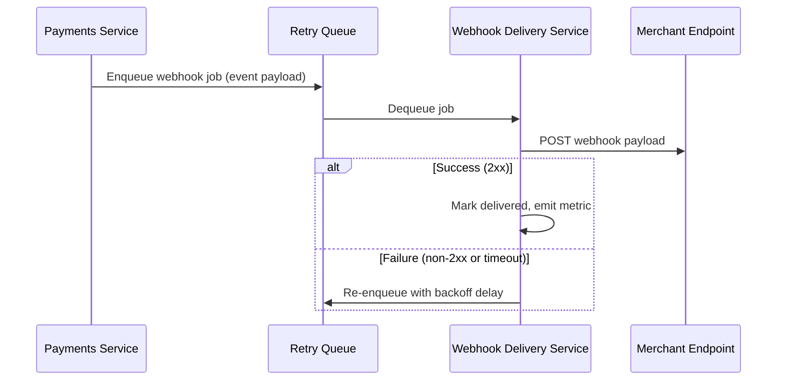

# Technical Design: Webhook Retry Logic for Payments Service

## 1. Objective

Implement reliable, observable webhook delivery with configurable exponential backoff retries so payment event notifications reach merchant endpoints even when transient failures occur, consistent with the payments service's event-driven architecture.

## 2. Technical Design

This design introduces a dedicated **Webhook Delivery Service** within the payments platform that decouples event emission from outbound HTTP delivery. When the payments service publishes a payment event (e.g., `payment.succeeded`, `payment.failed`), the Webhook Delivery Service enqueues a delivery job and attempts HTTP POST delivery to the merchant's registered endpoint.



**Architecture alignment:** This design adheres to the project's architecture standards documented in `standards-architecture.md` (see `skills/sdlc/spec-architecture/SKILL.md`). Specifically:

- **Process View:** Webhook delivery is modeled as an asynchronous background process, separating payment transaction completion from merchant notification (aligns with event-driven process view).
- **Architectural Drivers:** Supports reliability and observability quality attributes by defaulting to retry with metrics and structured logging.
- **Logical View:** The Webhook Delivery Service is a distinct module with a single responsibility (outbound HTTP delivery), interacting with the payments service only through a stable queue interface (loose coupling).
- **Data View:** Delivery state is persisted in a dedicated `webhook_deliveries` table, consistent with the platform's relational persistence layer for operational data.

The payments service remains unchanged in its core transaction flow; it only publishes events to the queue after successful payment processing.

## 3. Key Changes

### 3.1. API Contracts

**Internal Admin API — `GET /admin/webhooks/deliveries/{deliveryId}`**

Returns delivery status for support and debugging.

```json
{
  "deliveryId": "whd_abc123",
  "eventType": "payment.succeeded",
  "status": "retrying",
  "attemptCount": 3,
  "nextRetryAt": "2026-08-21T18:05:00Z",
  "lastError": "HTTP 503 from merchant endpoint"
}
```

| Status Code | Meaning |
|-------------|---------|
| 200 | Delivery record found |
| 404 | Delivery ID not found |

**Webhook payload (outbound to merchant)** — unchanged contract; POST with `Content-Type: application/json`, HMAC signature in `X-Webhook-Signature` header.

### 3.2. Data Models

**New table: `webhook_deliveries`**

| Column | Type | Description |
|--------|------|-------------|
| `id` | UUID | Primary key |
| `merchant_id` | UUID | FK to merchants |
| `event_id` | UUID | FK to payment events |
| `endpoint_url` | TEXT | Target URL |
| `payload` | JSONB | Serialized webhook body |
| `status` | ENUM | `pending`, `delivering`, `delivered`, `retrying`, `exhausted` |
| `attempt_count` | INT | Number of delivery attempts |
| `next_retry_at` | TIMESTAMP | Scheduled next attempt (nullable) |
| `last_error` | TEXT | Last failure reason |
| `created_at` | TIMESTAMP | Record creation time |
| `delivered_at` | TIMESTAMP | Successful delivery time (nullable) |

**New table: `webhook_delivery_attempts`** (audit trail)

| Column | Type | Description |
|--------|------|-------------|
| `id` | UUID | Primary key |
| `delivery_id` | UUID | FK to webhook_deliveries |
| `attempt_number` | INT | 1-based attempt index |
| `http_status` | INT | Response status (nullable on timeout) |
| `duration_ms` | INT | Request duration |
| `error_message` | TEXT | Failure detail |
| `attempted_at` | TIMESTAMP | Attempt timestamp |

### 3.3. Component Responsibilities

| Component | Role |
|-----------|------|
| **Payments Service** | Publishes payment events to the retry queue after transaction commit; does not perform HTTP delivery. |
| **Webhook Delivery Service** | Consumes queue jobs, executes HTTP POST, evaluates response, schedules retries with exponential backoff, persists state. |
| **Retry Queue (e.g., Redis/SQS)** | Holds pending and delayed retry jobs; supports visibility timeout for in-flight jobs. |
| **Retry Scheduler** | Computes next retry timestamp using exponential backoff: `delay = min(baseDelay * 2^attempt, maxDelay)` with jitter. |
| **Admin API** | Exposes read-only delivery status for operations and support. |
| **Observability Layer** | Emits metrics (`webhook.delivery.success`, `webhook.delivery.retry`, `webhook.delivery.exhausted`), structured logs, and trace spans per delivery attempt. |

## 4. Alternatives Considered

| Alternative | Why Not Chosen |
|-------------|----------------|
| **Synchronous delivery in payments request path** | Blocks payment response; merchant latency directly impacts checkout UX. Violates fail-safe design — a slow merchant endpoint would degrade payment processing. |
| **Fixed-interval retries (e.g., every 5 minutes)** | Does not adapt to failure severity; exponential backoff reduces load on struggling endpoints while still retrying promptly early on. |
| **Third-party webhook relay (e.g., Svix, Hookdeck)** | Adds external dependency and cost; in-house queue-based delivery aligns with existing infrastructure and observability standards. |
| **Dead-letter queue only (no retries)** | Insufficient for transient network blips common in payment notifications; retries are required for merchant SLA compliance. |

**Chosen approach:** Asynchronous queue-based delivery with exponential backoff, bounded max attempts (default 8 over ~24 hours), and full observability — balances reliability, merchant endpoint protection, and architectural consistency.

## 5. Out of Scope

- Webhook endpoint registration and merchant UI for managing endpoints
- Payload schema changes for payment events
- Webhook signature verification on the merchant side (merchant responsibility)
- Rate limiting of outbound delivery per merchant
- Manual replay/retry UI for operations (future work item)
- Multi-region failover for the delivery service
- Changing the payments service core transaction logic
